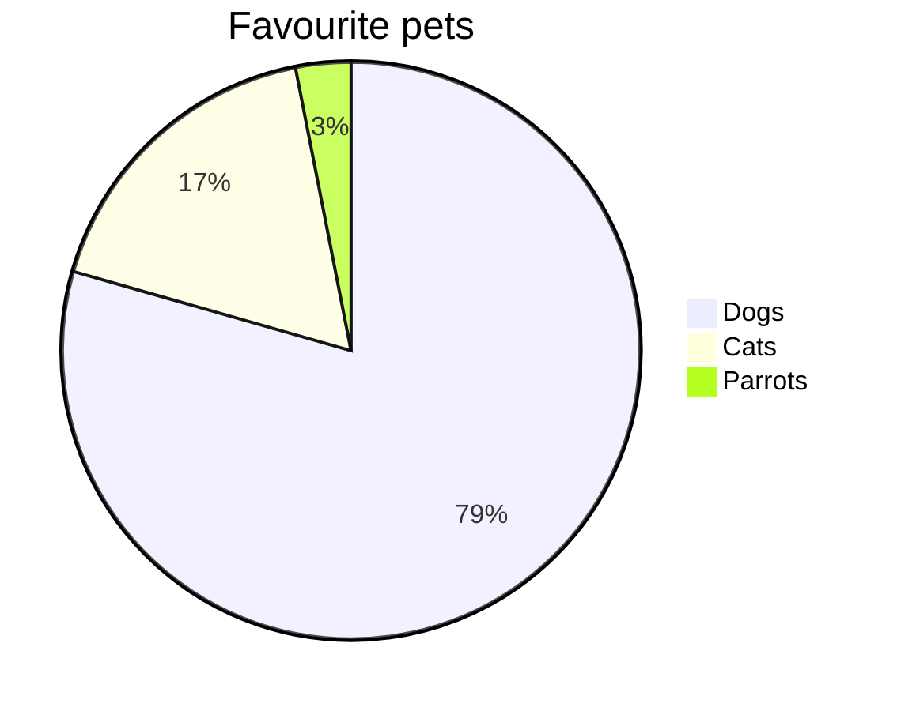

# Special rendering (neowriter specific)

## Dialogue — em-dash
Lines starting with `- ` (not a todo) are rendered with an em-dash:

- She glanced at the window.  
- He didn't answer.

## Scene break — dinkus
A line containing only `***` becomes a centred scene-break ornament:

***

## Arrows
Type these shorthands to get typographic arrows:

`-->` → &nbsp; `<--` ← &nbsp; `<-->` ↔

`==>` ⇒ &nbsp; `<==` ⇐ &nbsp; `<==>` ⇔

## Dice
`[.]` through `[......]` render as dice-face symbols:

[.] [..] [...] [....] [.....] [......]

## Keywords (‡)
Lines starting with **‡** inside a highlight become keyword tags in the left panel.
Type ‡ with a right-click → *Insert keyword*, or directly.

‡example-tag

## Highlight hover
Typing a word that matches a highlight name in the editor shows a tooltip on hover in the preview, displaying the first lines of that highlight (and its picture, if any).

## Emoji shortcodes
`:shortcode:` is replaced with the corresponding emoji:

:smile: :heart: :coffee: :tada: :thumbsup: :star:

## Diagrams (Mermaid)
Fenced code blocks tagged `mermaid` render as diagrams:

