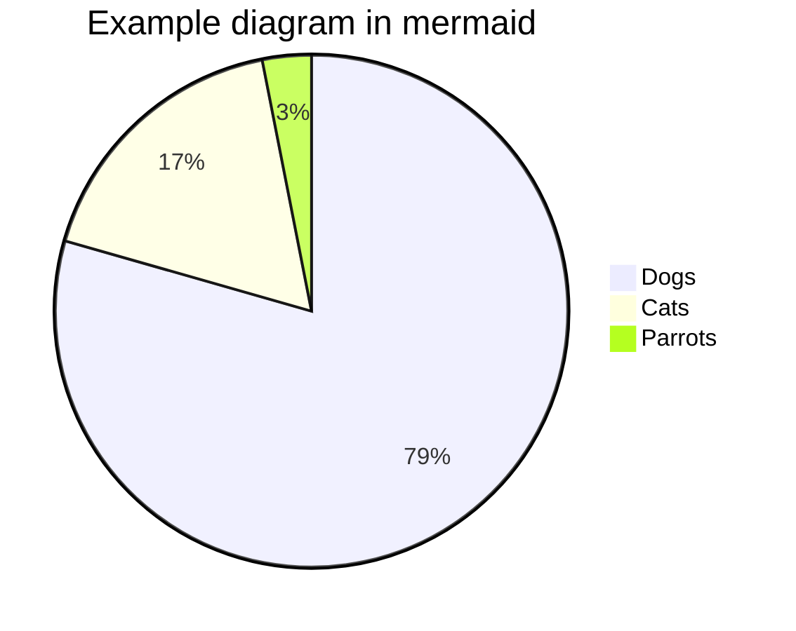

# Other renderings (neowriter specific)

- em-dash (for dialogs)

***

--> <-- <--> ==> <== <==> 

[.][..][...][....][.....][......]

‡keyword (can be added with a right-click)

typing a word that matches a highlight can be hovered over with the mouse to reveal its first lines / its picture (if any)

